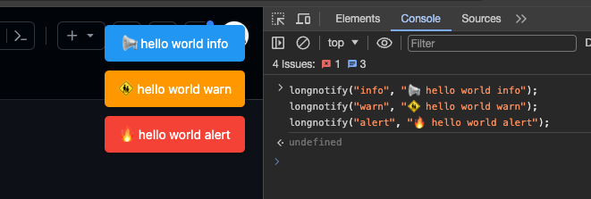

# monkey-longnotify

W(￣_￣)W  

🤯 I JUST WANT TO using notify simply 🤯


if you are in broswer, just using:  
> longnotify(level : "info" | "warn" | "alert" , message: str)

for example:
```js
longnotify("info", "📢 hello world info");
longnotify("warn", "🚸 hello world warn");
longnotify("alert", "🔥 hello world alert");
```

looking like this:


😊 hope you enjoy it ~ 
